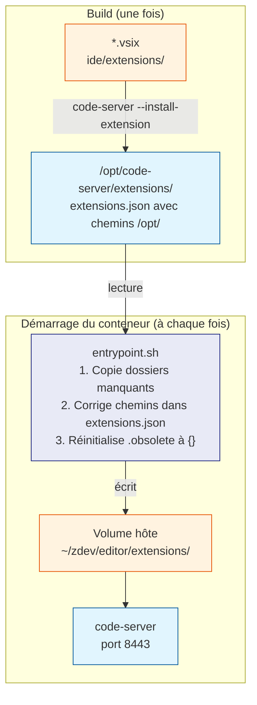

# Mécanisme des extensions VS Code

Ce mécanisme répond à un problème fondamental lié aux volumes Docker.

## Le problème : le volume masque l'image

Docker monte les volumes **après** la création des couches de l'image. Si les
extensions étaient installées dans le chemin par défaut de code-server
(`/home/zdev/.local/share/code-server/extensions/`), le volume
`~/zdev/editor/extensions:/home/zdev/.local/share/code-server/extensions`
remplacerait ce dossier par le dossier vide de l'hôte au premier démarrage.

## La solution : staging dans `/opt/`

Les extensions sont installées dans `/opt/code-server/extensions/` lors du
build — un chemin **jamais monté** comme volume. À chaque démarrage,
`entrypoint.sh` les synchronise vers le volume.

## Fichiers critiques

**`extensions.json`** est le registre interne de code-server. Sans lui (ou avec
des chemins incorrects), code-server ne reconnaît pas les extensions présentes
dans le dossier et les marque comme orphelines à supprimer.

**`.obsolete`** est la liste des extensions que code-server doit supprimer au
prochain démarrage. Lorsque code-server trouve des extensions non enregistrées,
il les y inscrit — elles disparaissent alors de l'interface. `entrypoint.sh`
réinitialise ce fichier à `{}` à chaque démarrage pour empêcher ce nettoyage.

## Persistance des extensions utilisateur

Les extensions installées depuis l'interface VS Code vont directement dans le
volume (`~/zdev/editor/extensions/`) et persistent entre les redémarrages.
Lors de la reconstruction de `extensions.json`, `entrypoint.sh` préserve ces
entrées supplémentaires (fusion avec le staging).

Si une extension du staging est supprimée du volume (manuellement ou par
code-server), elle est restaurée automatiquement au démarrage suivant.
