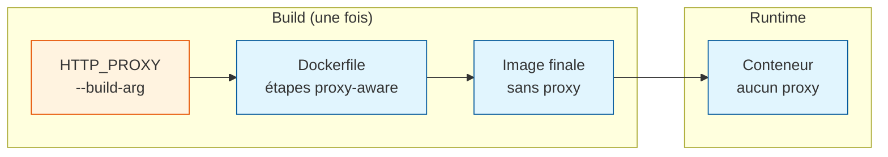

# Vue d'ensemble de l'architecture

## Services

| Service     | Port | Base image         | Rôle                                              |
|-------------|------|--------------------|---------------------------------------------------|
| `zdev-ide`  | 8443 | Debian             | code-server + IBM mainframe tools + Java 21, Node, Python |
| `zdev-api`  | 5000 | python:3.14-slim   | API FastAPI (backend du projet)                   |

Les deux services sont définis dans `docker-compose.yml` et partagent le réseau
Docker `zdev_default` — `zdev-ide` peut appeler `zdev-api` via
`http://zdev-api:5000` sans passer par l'hôte.

---

## Structure du projet

```
zdev/
├── Makefile                  ← Point d'entrée unique (build, run, setup)
├── docker-compose.yml        ← Définition des deux services
├── .env.example              ← Template de configuration
│
├── ide/                      ← Conteneur IDE (code-server + outils IBM)
│   ├── Dockerfile            ← Multi-platform (AMD64/ARM64)
│   ├── entrypoint.sh         ← Extension sync + startup logic
│   ├── settings.json         ← Paramètres VS Code injectés au démarrage
│   ├── ruff.toml             ← Configuration linter Python
│   ├── setup_host.sh         ← Crée ~/zdev/ sur l'hôte
│   ├── fetch_extensions.sh   ← Télécharge les .vsix
│   ├── copilot/              ← Instructions GitHub Copilot
│   │   ├── instructions.md   ← Instructions globales (tous fichiers)
│   │   └── instructions/
│   │       ├── mainframe.instructions.md  ← COBOL, JCL, z/OS, Db2, CICS
│   │       └── scripting.instructions.md  ← Python, Bash, TypeScript
│   ├── extensions/           ← Fichiers .vsix (gitignorés)
│   └── zowe/                 ← Archives Zowe CLI hors-ligne (offline)
│
└── api/                      ← Conteneur API (FastAPI + uvicorn)
    ├── Dockerfile
    ├── pyproject.toml
    └── src/zapi/
```

---

## Multi-plateforme

Un seul `Dockerfile` gère les deux architectures. La détection se fait via
`uname -m` dans le `Makefile` :

| Machine                   | Plateforme       |
|---------------------------|------------------|
| Linux x86_64              | `linux/amd64`    |
| macOS Apple Silicon (M1+) | `linux/arm64`    |

---

## Proxy d'entreprise

Le proxy est passé au build via `--build-arg` et **supprimé de l'image finale**.
Le conteneur en cours d'exécution ne connaît pas le proxy.


