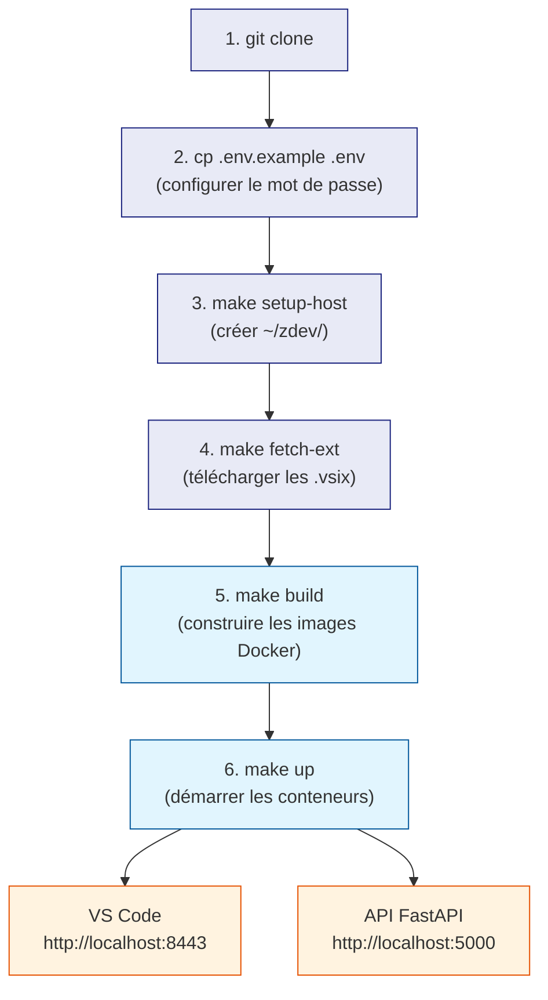

# Arborescence du projet

Cette page décrit chaque fichier et chaque dossier du projet zdev.
Elle est destinée aux débutants qui découvrent le projet.

---

## Vue d'ensemble

```
zdev/
├── Makefile                    ← Toutes les commandes du projet (build, run…)
├── docker-compose.yml          ← Les deux services Docker et leurs volumes
├── .env.example                ← Modèle de configuration à copier en .env
├── .editorconfig               ← Normes d'encodage (UTF-8, LF, indentation)
├── .gitignore                  ← Fichiers ignorés par Git
├── CLAUDE.md                   ← Guide pour l'assistant IA Claude Code
├── README.md                   ← Documentation principale (Français)
├── pyproject.toml              ← Dépendances Python pour MkDocs (racine)
├── mkdocs.yml                  ← Configuration du site de documentation
│
├── ide/                        ← Conteneur IDE (VS Code dans le navigateur)
│   ├── Dockerfile              ← Construction de l'image zdev-ide
│   ├── entrypoint.sh           ← Script de démarrage du conteneur
│   ├── settings.json           ← Paramètres VS Code injectés à la 1ère ouverture
│   ├── ruff.toml               ← Configuration du linter Python (Ruff)
│   ├── setup_host.sh           ← Crée ~/zdev/ sur la machine hôte
│   ├── fetch_extensions.sh     ← Télécharge les extensions .vsix
│   ├── copilot/
│   │   ├── instructions.md     ← Instructions Copilot (tous fichiers)
│   │   └── instructions/
│   │       ├── mainframe.instructions.md  ← Règles COBOL, JCL, z/OS
│   │       └── scripting.instructions.md  ← Règles Python, Bash, TypeScript
│   ├── extensions/             ← Fichiers .vsix téléchargés (gitignorés)
│   │   └── .gitkeep            ← Garde le dossier dans Git même s'il est vide
│   └── zowe/                   ← Archives Zowe CLI pour installation hors-ligne
│       ├── zowe-cli-package-3.4.1/
│       └── zowe-cli-plugins-3.4.1/
│
├── api/                        ← Conteneur API (backend FastAPI)
│   ├── Dockerfile              ← Construction de l'image zdev-api
│   ├── pyproject.toml          ← Dépendances Python de l'API
│   ├── .python-version         ← Version Python exigée (3.14)
│   ├── uv.lock                 ← Versions exactes des dépendances (versionné)
│   ├── README.md               ← Documentation de l'API
│   └── src/
│       └── zapi/
│           ├── __init__.py     ← Marque le dossier comme package Python
│           └── main.py         ← Code de l'API FastAPI
│
├── docs/                       ← Source du site de documentation (MkDocs)
│   ├── index.md                ← Page d'accueil du site
│   ├── depannage.md            ← Solutions aux problèmes courants
│   ├── stylesheets/
│   │   └── extra.css           ← CSS personnalisé (largeur 100 %)
│   ├── guide/                  ← Guides pratiques
│   │   ├── installation.md
│   │   ├── utilisation.md
│   │   ├── arborescence.md     ← Cette page
│   │   └── zowe.md
│   ├── architecture/           ← Explications techniques internes
│   │   ├── vue-ensemble.md
│   │   ├── extensions.md
│   │   └── persistance.md
│   ├── sources/                ← Lecture annotée de chaque fichier source
│   │   ├── index.md
│   │   ├── dockerfile.md
│   │   ├── entrypoint.md
│   │   ├── fetch-extensions.md
│   │   ├── setup-host.md
│   │   ├── docker-compose.md
│   │   ├── makefile.md
│   │   └── api-code.md
│   ├── extensions/             ← Référence des extensions VS Code
│   │   ├── index.md
│   │   └── … (une page par extension)
│   └── api/
│       └── reference.md        ← Référence des endpoints FastAPI
│
└── site/                       ← Site statique généré (gitignorés)
```

---

## Rôle de chaque fichier — détail

### Racine du projet

| Fichier | Ce qu'il fait |
|---------|---------------|
| `Makefile` | Point d'entrée unique. Toutes les opérations (`make build`, `make up`…) sont définies ici. Détecte automatiquement l'architecture CPU. |
| `docker-compose.yml` | Décrit les deux services (`zdev-ide` et `zdev-api`), leurs ports, leurs volumes et leurs variables d'environnement. |
| `.env.example` | Modèle à copier en `.env`. Contient les variables que vous devez adapter (mot de passe, fuseau horaire, proxy). |
| `.editorconfig` | Indique aux éditeurs (VS Code, Zed…) les règles d'encodage : UTF-8, fins de ligne Unix (LF), 4 espaces d'indentation, etc. |
| `.gitignore` | Liste les fichiers que Git ne doit pas versionner : `.env` (secrets), `site/` (build auto), `*.vsix` (binaires lourds), `.venv/` (virtualenvs). |
| `CLAUDE.md` | Guide de contexte pour l'assistant IA Claude Code. Décrit l'architecture, les conventions et les commandes du projet. |
| `README.md` | Documentation principale en Français. Présente le projet, les prérequis et les étapes d'installation. |
| `pyproject.toml` | Déclare les dépendances Python nécessaires pour générer le site MkDocs (mkdocs-material, plugins…). |
| `mkdocs.yml` | Configure le site de documentation : navigation, thème Material, plugins, extensions Markdown. |

---

### Dossier `ide/` — le conteneur VS Code

Ce dossier contient tout ce qui est nécessaire pour construire l'image Docker
`zdev-ide`, qui fait tourner VS Code dans votre navigateur avec tous les outils
IBM z/OS pré-installés.

| Fichier | Ce qu'il fait |
|---------|---------------|
| `Dockerfile` | Recette de construction de l'image. 13 étapes : paquets système, Java, Node.js, Zowe CLI, code-server, extensions VS Code… |
| `entrypoint.sh` | Lancé automatiquement quand le conteneur démarre. Synchronise les extensions, copie les paramètres VS Code, puis lance code-server. |
| `settings.json` | Paramètres VS Code : thème, police, linter Python, formateurs, configuration IBM Z Open Editor et Zowe Explorer. Copié dans le conteneur au premier démarrage uniquement. |
| `ruff.toml` | Configuration du linter/formateur Python Ruff (longueur de ligne 88 caractères, règles de style). Copié à chaque démarrage. |
| `setup_host.sh` | Crée l'arborescence `~/zdev/` sur votre machine. À exécuter une seule fois. Crée les dossiers montés comme volumes Docker. |
| `fetch_extensions.sh` | Interroge le Marketplace VS Code et télécharge les fichiers `.vsix` dans `ide/extensions/`. À exécuter avant `make build`. |
| `copilot/instructions.md` | Instructions globales pour GitHub Copilot (s'appliquent à tous les types de fichiers). |
| `copilot/instructions/mainframe.instructions.md` | Standards de code COBOL, JCL, JES2, Db2, CICS — appliqués automatiquement par Copilot sur ces fichiers. |
| `copilot/instructions/scripting.instructions.md` | Standards de code Python, Bash, TypeScript — appliqués automatiquement par Copilot sur ces fichiers. |
| `extensions/` | Dossier qui reçoit les fichiers `.vsix` téléchargés par `fetch_extensions.sh`. Gitignorés car binaires volumineux. |
| `extensions/.gitkeep` | Fichier vide qui force Git à versionner le dossier `extensions/` même quand il est vide. |
| `zowe/` | Archives des paquets Zowe CLI pré-téléchargées pour pouvoir installer Zowe sans accès Internet depuis le conteneur. |

---

### Dossier `api/` — le backend FastAPI

Ce dossier contient le code de l'API Python qui tourne en parallèle de l'IDE.
L'IDE peut l'appeler via `http://zdev-api:5000` grâce au réseau Docker interne.

| Fichier | Ce qu'il fait |
|---------|---------------|
| `Dockerfile` | Construit l'image `zdev-api`. Utilise Python 3.14-slim, installe les dépendances avec `uv`, copie le code source. |
| `pyproject.toml` | Déclare les dépendances de l'API : FastAPI, Pydantic, uvicorn. Ruff en dépendance de développement. |
| `.python-version` | Indique à `uv` quelle version Python utiliser (3.14). Utilisé en développement local et dans l'image Docker. |
| `uv.lock` | Versions exactes et hashes de toutes les dépendances. **Doit être versionné** pour garantir des builds reproductibles. |
| `src/zapi/__init__.py` | Fichier vide qui transforme le dossier `zapi/` en package Python importable. |
| `src/zapi/main.py` | Le code de l'API : définit l'application FastAPI et les endpoints. Actuellement un seul endpoint `GET /`. |

---

### Dossier `docs/` — le site de documentation

Contient les sources Markdown du site MkDocs. Le site est généré dans `site/`
par `make docs-build`, ou servi en direct par `make docs`.

| Sous-dossier | Contenu |
|--------------|---------|
| `guide/` | Guides pratiques : installation pas à pas, utilisation quotidienne, configuration Zowe |
| `architecture/` | Explications des choix techniques : mécanisme des extensions, persistance des données, proxy |
| `sources/` | Lecture annotée de chaque fichier source du projet — pour comprendre comment fonctionne chaque script |
| `extensions/` | Référence complète des 35+ extensions VS Code pré-installées : rôle, prérequis, licences |
| `api/` | Référence des endpoints de l'API FastAPI |
| `stylesheets/` | CSS personnalisé (largeur de page 100 %) |

---

## Flux de travail complet



!!! tip "À retenir"
    - `ide/` et `api/` sont deux projets Docker indépendants.
    - `docs/` est le site de documentation — indépendant des conteneurs.
    - `~/zdev/` sur votre machine hôte est l'espace de persistance — sans lui, vos données disparaissent à chaque recréation de conteneur.
