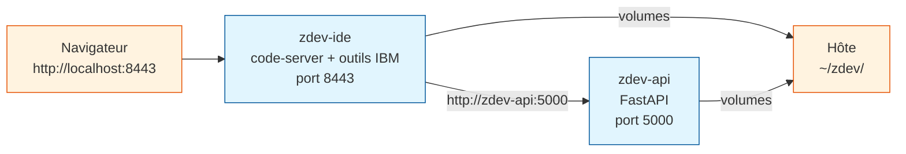

# zdev — Environnement de développement mainframe IBM z/OS

**zdev** est un environnement de développement complet pour IBM z/OS, accessible
depuis un navigateur, prêt à l'emploi sans installation manuelle d'outils.

Il fonctionne sur **macOS Apple Silicon (ARM64)** en entreprise derrière un proxy
et sur **Linux Ubuntu 24.04 (AMD64)** à domicile — le même `Dockerfile` et le
même `Makefile` gèrent les deux automatiquement.

---

## Services

| Conteneur   | Port  | Rôle                                                        |
|-------------|-------|-------------------------------------------------------------|
| `zdev-ide`  | 8443  | VS Code dans le navigateur + outils mainframe IBM           |
| `zdev-api`  | 5000  | API FastAPI (backend, appelable depuis l'IDE via `curl`)    |

**Outils inclus dans l'IDE :**

- [code-server](https://github.com/coder/code-server) — VS Code dans le navigateur
- [Zowe CLI v3](https://docs.zowe.org/) + plugins (CICS, MQ, FTP, RSE API)
- Java 21 (requis par les extensions IBM), Node.js LTS, Python 3 + `uv`
- MkDocs Material (serve, build)

**Extensions VS Code pré-installées :**

| Catégorie | Extensions |
|-----------|------------|
| IBM z/OS  | Z Open Editor, Z Open Debug, Z File Manager, Z Fault Analyzer, APA, Compiled Code Coverage, TAZ |
| Zowe      | Zowe Explorer, CICS Explorer, FTP Extension, Db2 for z/OS Developer Extension |
| Python    | ms-python, Pylance, debugpy, python-envs, Ruff |
| Shell     | ShellCheck, shfmt |
| Formats   | TOML, JSON, YAML, XML, Rainbow CSV |
| Interface | Material Icons, Material Product Icons, Catppuccin |
| IA        | GitHub Copilot, GitHub Copilot Chat |
| Git & Doc | Git Graph, Markdown All in One |

→ [Référence complète des extensions](extensions/index.md) — prérequis, licences IBM et configuration.

---

## Démarrage rapide

```bash
cp .env.example .env          # Configurer IDE_PASSWORD, TZ, HTTP_PROXY
make setup-host               # Créer ~/zdev/ sur l'hôte (première fois)
make fetch-ext                # Télécharger les extensions .vsix
make build                    # Builder les deux images Docker
make up                       # Démarrer les conteneurs
```

VS Code est ensuite disponible sur **http://localhost:8443**.


