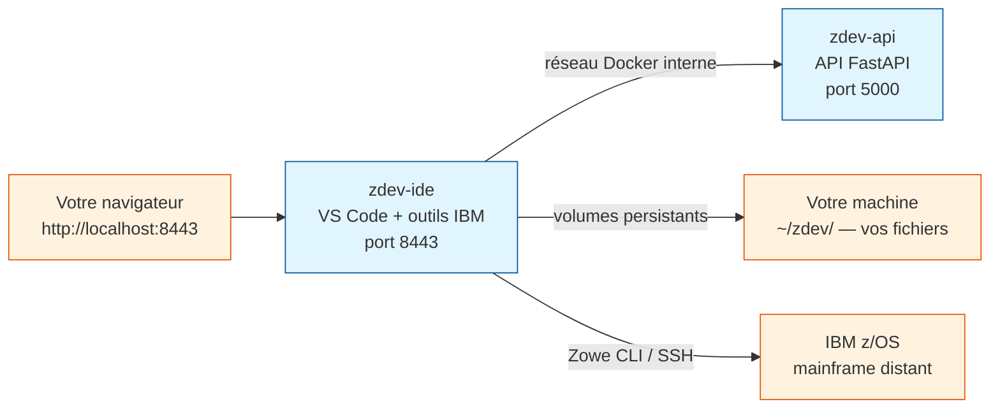

# zdev — Environnement de développement mainframe IBM z/OS

**zdev** est un environnement de développement **complet et prêt à l'emploi**
pour IBM z/OS. Il tourne entièrement dans Docker : aucun outil à installer
manuellement sur votre machine, sauf Docker et Make.

Ouvrez un navigateur, tapez `http://localhost:8443` — VS Code s'ouvre,
avec tous les outils IBM z/OS déjà configurés.

---

## Ce que vous obtenez



---

## Services inclus

| Conteneur   | Port  | Rôle                                                        |
|-------------|-------|-------------------------------------------------------------|
| `zdev-ide`  | 8443  | VS Code dans le navigateur + outils mainframe IBM           |
| `zdev-api`  | 5000  | API FastAPI (backend, appelable depuis l'IDE via `curl`)    |

### Ce que contient `zdev-ide`

| Catégorie | Outils |
|-----------|--------|
| **Éditeur** | [code-server](https://github.com/coder/code-server) — VS Code dans le navigateur |
| **Mainframe** | [Zowe CLI v3](https://docs.zowe.org/) + plugins CICS, MQ, FTP, RSE API |
| **Runtime** | Java 21 (requis par les extensions IBM), Node.js 24 LTS, Python 3 + `uv` |
| **Documentation** | MkDocs Material (serve, build) |

### Extensions VS Code pré-installées

| Catégorie | Extensions |
|-----------|------------|
| IBM z/OS  | Z Open Editor, Z Open Debug, Z File Manager, Z Fault Analyzer, APA, Compiled Code Coverage |
| Zowe      | Zowe Explorer, CICS Explorer, FTP Extension, Db2 for z/OS Developer Extension |
| Python    | ms-python, Pylance, debugpy, python-envs, Ruff |
| Shell     | ShellCheck, shfmt |
| Formats   | TOML, JSON, YAML, XML, Rainbow CSV |
| Interface | Material Icons, Material Product Icons, Catppuccin |
| IA        | GitHub Copilot, GitHub Copilot Chat |
| Git & Doc | Git Graph, Markdown All in One |

→ [Référence complète des extensions](extensions/index.md) — prérequis, licences IBM et configuration.

---

## Démarrage rapide

!!! info "Prérequis"
    - **Docker** (Engine ou Desktop) installé sur votre machine
    - **Make** (`make --version` pour vérifier)
    - ~10 Go d'espace disque libre
    - Connexion Internet (pour le premier `make fetch-ext` et `make build`)

```bash
# 1. Copier le fichier de configuration
cp .env.example .env
# Éditer .env : changer IDE_PASSWORD (et HTTP_PROXY si derrière un proxy)

# 2. Créer les dossiers de persistance sur votre machine
make setup-host

# 3. Télécharger les extensions VS Code
make fetch-ext

# 4. Construire les images Docker (10 à 20 min la première fois)
make build

# 5. Démarrer
make up
```

VS Code est ensuite disponible sur **http://localhost:8443**.

---

## Compatibilité

| Machine                    | Système          | Architecture |
|----------------------------|------------------|--------------|
| Linux x86_64               | Ubuntu, Debian… | ✅ AMD64     |
| macOS Apple Silicon (M1+)  | macOS 13+        | ✅ ARM64     |

Un seul `Dockerfile` gère les deux architectures automatiquement.
Le `Makefile` détecte votre processeur et configure le build en conséquence.

---

## Vos données sont persistantes

Vos projets, profils Zowe et paramètres VS Code sont stockés dans `~/zdev/`
sur votre machine. Ils **survivent** à la suppression et à la recréation
des conteneurs.

```
~/zdev/
├── projects/       ← Vos fichiers COBOL, JCL, scripts…
├── zowe/           ← Profils de connexion z/OS
└── editor/
    ├── settings/   ← Vos paramètres VS Code
    └── extensions/ ← Extensions installées depuis l'interface
```

→ [Détail de la persistance](architecture/persistance.md)

---

## Pour aller plus loin

<div class="grid cards" markdown>

-   **Guide d'installation**

    ---

    Installation pas à pas, options proxy, prérequis détaillés.

    [:octicons-arrow-right-24: Installation](guide/installation.md)

-   **Arborescence du projet**

    ---

    Rôle de chaque fichier et dossier, expliqué pour les débutants.

    [:octicons-arrow-right-24: Arborescence](guide/arborescence.md)

-   **Lecture des sources**

    ---

    Chaque fichier source analysé ligne par ligne, pour comprendre le fonctionnement interne.

    [:octicons-arrow-right-24: Sources](sources/index.md)

-   **Extensions VS Code**

    ---

    35+ extensions pré-installées — licences IBM, configuration, utilisation.

    [:octicons-arrow-right-24: Extensions](extensions/index.md)

-   **Configurer Zowe**

    ---

    Se connecter à un mainframe z/OS via RSE API, z/OSMF ou FTP.

    [:octicons-arrow-right-24: Zowe CLI](guide/zowe.md)

-   **Dépannage**

    ---

    Solutions aux problèmes courants.

    [:octicons-arrow-right-24: Dépannage](depannage.md)

</div>
