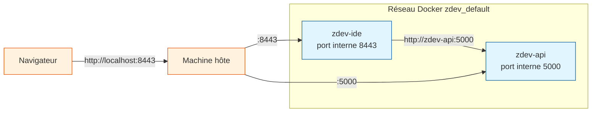

# docker-compose.yml — ligne par ligne

`docker-compose.yml` est le fichier de configuration qui décrit les deux
services du projet (`zdev-api` et `zdev-ide`), comment ils démarrent,
quels ports ils exposent et quelles données ils partagent avec l'hôte.

**Fichier :** `docker-compose.yml`
**Utilisé par :** `make up`, `make down`, `make logs`

---

## Structure globale

```yaml
services:
  zdev-api:     # Service 1 : API FastAPI
    …
  zdev-ide:     # Service 2 : VS Code dans le navigateur
    …
```

Docker Compose crée automatiquement un réseau `zdev_default` qui relie
les deux services. Chaque service peut appeler l'autre par son nom :
`zdev-api` est accessible depuis `zdev-ide` via `http://zdev-api:5000`.

---

## Service zdev-api

```yaml
zdev-api:
  build:
    context: api/
    dockerfile: Dockerfile
  image: zdev-api:latest
  container_name: zdev-api
  restart: unless-stopped
  environment:
    - TZ=${TZ:-Europe/Paris}
    - LANG=C.UTF-8
  ports:
    - "5000:5000"
  healthcheck:
    test: ["CMD", "python", "-c",
           "import urllib.request; urllib.request.urlopen('http://localhost:5000/')"]
    interval: 30s
    timeout: 10s
    retries: 5
```

### build

```yaml
build:
  context: api/
  dockerfile: Dockerfile
```

`context: api/` — Le dossier de build. Tous les fichiers copiés dans l'image
(`COPY` dans le Dockerfile) doivent se trouver dans ce dossier.

`dockerfile: Dockerfile` — Nom du Dockerfile à utiliser. Explicite mais
optionnel (Docker cherche `Dockerfile` par défaut).

### image et container_name

```yaml
image: zdev-api:latest
container_name: zdev-api
```

`image` — Nommage de l'image construite. Utile pour la retrouver avec
`docker images` ou pour la partager.

`container_name` — Nom fixe du conteneur en cours d'exécution. Sans cela,
Docker génère un nom aléatoire (ex. `zdev_zdev-api_1`). Le nom fixe permet
d'utiliser `docker exec zdev-api bash`.

### restart

```yaml
restart: unless-stopped
```

Le conteneur redémarre automatiquement si Docker Engine redémarre (au boot
de la machine) **sauf** si vous l'avez arrêté manuellement avec `make down`
ou `docker stop`. C'est le comportement idéal pour un service de dev.

### environment

```yaml
environment:
  - TZ=${TZ:-Europe/Paris}
  - LANG=C.UTF-8
```

`${TZ:-Europe/Paris}` — Lit la variable `TZ` depuis votre fichier `.env`.
Si elle n'est pas définie, utilise `Europe/Paris` comme valeur par défaut.

`LANG=C.UTF-8` — Force l'encodage UTF-8 dans le conteneur pour éviter
les problèmes d'affichage des caractères spéciaux (accents, etc.).

### ports

```yaml
ports:
  - "5000:5000"
```

Format : `"port_hôte:port_conteneur"`.
L'API écoute sur le port 5000 à l'intérieur du conteneur et est accessible
sur le port 5000 de la machine hôte.

Accès :
- Depuis l'hôte : `http://localhost:5000/`
- Depuis le navigateur : `http://localhost:5000/docs`

### healthcheck

```yaml
healthcheck:
  test: ["CMD", "python", "-c",
         "import urllib.request; urllib.request.urlopen('http://localhost:5000/')"]
  interval: 30s
  timeout: 10s
  retries: 5
```

Docker vérifie toutes les 30 secondes si l'API répond correctement.
`urllib.request` est utilisé à la place de `curl` car Python est toujours
disponible dans l'image, mais `curl` n'y est pas forcément.

Si 5 vérifications consécutives échouent, le conteneur est marqué `unhealthy`
(visible dans `docker compose ps`).

---

## Service zdev-ide

```yaml
zdev-ide:
  build:
    context: ide/
    dockerfile: Dockerfile
  image: zdev-ide:latest
  container_name: zdev-ide
  restart: unless-stopped
  environment:
    - PASSWORD=${IDE_PASSWORD:-zdev}
    - TZ=${TZ:-Europe/Paris}
    - LANG=C.UTF-8
  ports:
    - "8443:8443"
  volumes:
    - ~/zdev/projects:/home/zdev/workspace
    - ~/zdev/zowe:/home/zdev/.zowe
    - ~/zdev/editor/settings:/home/zdev/.local/share/code-server/User
    - ~/zdev/editor/extensions:/home/zdev/.local/share/code-server/extensions
    - ~/zdev/cache/npm:/home/zdev/.npm
    - ~/zdev/cache/pip:/home/zdev/.cache/pip
    - ~/zdev/.zshrc:/home/zdev/.zshrc
    - ~/zdev/.gitconfig:/home/zdev/.gitconfig
    - ~/.ssh:/home/zdev/.ssh:ro
  healthcheck:
    test: ["CMD", "curl", "-fsS", "http://localhost:8443/healthz"]
    interval: 30s
    timeout: 10s
    retries: 5
```

### PASSWORD

```yaml
environment:
  - PASSWORD=${IDE_PASSWORD:-zdev}
```

Variable lue par code-server pour l'authentification. Elle provient de
votre fichier `.env` (`IDE_PASSWORD=mon-mot-de-passe`). La valeur par
défaut `zdev` est à changer absolument si le port 8443 est exposé au-delà
de la machine locale.

### Volumes — le cœur de la persistance

```yaml
volumes:
  - ~/zdev/projects:/home/zdev/workspace
  - ~/zdev/zowe:/home/zdev/.zowe
  - ~/zdev/editor/settings:/home/zdev/.local/share/code-server/User
  - ~/zdev/editor/extensions:/home/zdev/.local/share/code-server/extensions
  - ~/zdev/cache/npm:/home/zdev/.npm
  - ~/zdev/cache/pip:/home/zdev/.cache/pip
  - ~/zdev/.zshrc:/home/zdev/.zshrc
  - ~/zdev/.gitconfig:/home/zdev/.gitconfig
  - ~/.ssh:/home/zdev/.ssh:ro
```

Format : `chemin_hôte:chemin_conteneur[:options]`.

Un volume crée un **miroir** entre un dossier de votre machine et un dossier
dans le conteneur. Toute modification d'un côté est immédiatement visible
de l'autre.

| Volume | Ce qu'il persiste |
|--------|-------------------|
| `~/zdev/projects` | Vos fichiers de code COBOL, JCL, scripts… |
| `~/zdev/zowe` | Profils Zowe (hôtes z/OS, identifiants) |
| `~/zdev/editor/settings` | Paramètres VS Code (settings.json, keybindings.json…) |
| `~/zdev/editor/extensions` | Extensions installées depuis l'interface VS Code |
| `~/zdev/cache/npm` | Cache npm (accélère les `npm install` dans le conteneur) |
| `~/zdev/cache/pip` | Cache pip/uv (accélère les `uv install` dans le conteneur) |
| `~/zdev/.zshrc` | Configuration du shell Zsh (aliases, fonction `zdev`…) |
| `~/zdev/.gitconfig` | Configuration Git (nom, email, aliases…) |
| `~/.ssh` | Clés SSH (lecture seule — vos clés ne sont jamais modifiées) |

`:ro` sur `~/.ssh` — Le dossier SSH est monté en **lecture seule** dans le
conteneur. Le conteneur peut utiliser vos clés pour se connecter à z/OS,
mais ne peut pas les modifier.

!!! warning "Ordre important"
    `make setup-host` doit être exécuté **avant** `make up` pour que tous
    ces dossiers existent. Sinon, Docker crée des dossiers vides avec des
    droits root à la place, ce qui cause des problèmes de permissions.

### healthcheck du conteneur IDE

```yaml
healthcheck:
  test: ["CMD", "curl", "-fsS", "http://localhost:8443/healthz"]
  interval: 30s
  timeout: 10s
  retries: 5
```

`/healthz` est un endpoint automatique de code-server qui retourne 200 quand
VS Code est prêt. `-fsS` : fail si HTTP ≥ 400, mode silencieux, erreurs affichées.

---

## Réseau Docker automatique

Docker Compose crée automatiquement un réseau nommé `zdev_default`.
Les deux services y sont connectés et peuvent se parler via leurs noms :



---

## Commandes utiles avec Docker Compose

```bash
docker compose ps        # État des conteneurs (running, unhealthy…)
docker compose logs -f   # Logs en temps réel des deux services
docker compose exec zdev-ide bash   # Shell dans le conteneur IDE
docker compose exec zdev-api bash   # Shell dans le conteneur API
docker compose restart zdev-ide     # Redémarrer uniquement l'IDE
```
