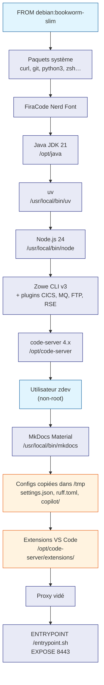

# ide/Dockerfile — ligne par ligne

Le `Dockerfile` est la recette de construction de l'image `zdev-ide`.
Il décrit, étape par étape, comment assembler un environnement contenant
VS Code, Java, Node.js, Zowe CLI et toutes les extensions IBM.

**Fichier :** `ide/Dockerfile`
**Résultat :** image Docker `zdev-ide:latest`
**Durée du build :** 10 à 20 minutes (première fois)

---

## En-tête et arguments de build

```dockerfile
# syntax=docker/dockerfile:1
FROM debian:bookworm-slim

ARG CODESERVER_VERSION=4.117.0
ARG NODE_VERSION=24.15.0

ARG HTTP_PROXY
ARG HTTPS_PROXY
ARG NO_PROXY=localhost,127.0.0.1,10.0.0.0/8
```

**`# syntax=docker/dockerfile:1`** — Active les dernières fonctionnalités du
moteur BuildKit de Docker. Doit être la toute première ligne.

**`FROM debian:bookworm-slim`** — L'image de base. Debian est choisi pour sa
stabilité en production et sa compatibilité avec les paquets APT requis par
les outils IBM. La variante `-slim` réduit la taille (pas de doc, pas d'extras).

**`ARG CODESERVER_VERSION` / `ARG NODE_VERSION`** — Variables passées au moment
du build. Si non renseignées, les valeurs par défaut sont utilisées. On peut
les surcharger avec `docker build --build-arg NODE_VERSION=22.0.0`.

**`ARG HTTP_PROXY`** — Le proxy d'entreprise. Passé par `make build PROXY=…`.
Il est utilisé pendant le build pour télécharger les paquets, puis supprimé
de l'image finale (voir étape 12).

---

## Étape 1 — Variables d'environnement proxy

```dockerfile
ENV DEBIAN_FRONTEND=noninteractive \
    HTTP_PROXY=${HTTP_PROXY} \
    HTTPS_PROXY=${HTTPS_PROXY} \
    http_proxy=${HTTP_PROXY} \
    https_proxy=${HTTPS_PROXY} \
    NO_PROXY=${NO_PROXY} \
    no_proxy=${NO_PROXY}
```

`DEBIAN_FRONTEND=noninteractive` — Évite que `apt-get` pose des questions
interactives pendant le build (comme le choix du fuseau horaire).

Les variables proxy sont définies deux fois (`HTTP_PROXY` et `http_proxy`)
pour couvrir les outils qui lisent l'une ou l'autre convention (certains outils
Linux utilisent les minuscules, d'autres les majuscules).

---

## Étape 2 — Paquets système

```dockerfile
RUN apt-get update && apt-get install -y --no-install-recommends \
    ca-certificates curl file fontconfig fonts-dejavu-core \
    git htop iproute2 jq less \
    libcairo2 libgdk-pixbuf-2.0-0 libpangocairo-1.0-0 \
    lsof nano openssh-client procps python3 python3-pip python3-venv \
    shellcheck shfmt tree unzip vim wget zip zsh \
    && rm -rf /var/lib/apt/lists/*
```

Un seul `RUN` regroupe `update` et `install` : si on les sépare, Docker peut
utiliser le cache APT d'une couche précédente périmée et récupérer de vieilles
versions de paquets.

`--no-install-recommends` — N'installe que les dépendances strictement
nécessaires (pas les "recommandés" qui alourdissent l'image inutilement).

`rm -rf /var/lib/apt/lists/*` — Supprime le cache APT de la couche Docker.
Sans cela, chaque image contiendrait plusieurs centaines de Mo de listes
de paquets inutiles.

**Ce que ces paquets apportent :**

| Paquet | Rôle |
|--------|------|
| `curl`, `wget` | Téléchargements réseau |
| `git` | Gestion de version |
| `jq` | Traitement JSON en ligne de commande |
| `python3`, `python3-pip`, `python3-venv` | Python 3 (pour les scripts et entrypoint.sh) |
| `shellcheck`, `shfmt` | Linter et formateur Shell (utilisés par les extensions VS Code) |
| `libcairo2`, `libgdk-pixbuf-2.0-0`, `libpangocairo-1.0-0` | Bibliothèques graphiques requises par code-server |
| `openssh-client` | Pour les connexions SSH vers z/OS |
| `zsh` | Shell par défaut de l'utilisateur `zdev` |
| `unzip` | Extraction des archives .vsix (ZIP) et autres |
| `fontconfig` | Gestion des polices (pour Fira Code) |

---

## Étape 3 — Police Fira Code Nerd Font

```dockerfile
RUN curl -fsSL -o /tmp/FiraCode.zip \
        https://github.com/ryanoasis/nerd-fonts/releases/latest/download/FiraCode.zip && \
    unzip /tmp/FiraCode.zip -d /usr/share/fonts/truetype/firacode && \
    rm /tmp/FiraCode.zip && fc-cache -f -v
```

Fira Code est une police de programmeur avec ligatures (les symboles `=>`, `!=`,
`->` etc. s'affichent comme de vrais caractères mathématiques). La variante
"Nerd Font" ajoute des icônes utilisées par les terminaux modernes et par
l'interface de code-server.

`fc-cache -f -v` — Reconstruit le cache des polices système pour que la nouvelle
police soit immédiatement détectée par les applications.

---

## Étape 4 — Java JDK 21

```dockerfile
RUN ARCH=$(uname -m) && \
    case "$ARCH" in \
        aarch64) JAVA_ARCH="aarch64" ;; \
        *)        JAVA_ARCH="x64" ;; \
    esac && \
    curl -fsSL -o /tmp/jdk.tar.gz \
        "https://github.com/adoptium/temurin21-binaries/releases/download/..." && \
    mkdir -p /opt/java && \
    tar -xzf /tmp/jdk.tar.gz -C /opt/java --strip-components=1 && \
    rm /tmp/jdk.tar.gz

ENV JAVA_HOME=/opt/java
ENV PATH="$JAVA_HOME/bin:$PATH"
```

**Pourquoi Java ?** Les extensions IBM (Z Open Editor, Z Open Debug…) sont des
plugins Eclipse repackagés en extensions VS Code. Elles nécessitent une JVM
pour s'exécuter.

**`uname -m`** — Détecte l'architecture du processeur :
- `x86_64` → Linux 64 bits classique → Java version `x64`
- `aarch64` → Apple Silicon (M1, M2, M3) ou ARM → Java version `aarch64`

**Eclipse Temurin** — Distribution Java open-source maintenue par le projet
Adoptium (anciennement AdoptOpenJDK). Gratuite, conforme au standard, utilisée
en production.

`--strip-components=1` — L'archive tar contient un dossier racine (ex.
`jdk-21.0.10+7/`). Cette option l'ignore pour extraire directement le contenu
dans `/opt/java`.

---

## Étape 5 — uv (gestionnaire de paquets Python)

```dockerfile
RUN ARCH=$(uname -m) && \
    case "$ARCH" in \
        aarch64) UV_ARCH="aarch64-unknown-linux-gnu" ;; \
        *)        UV_ARCH="x86_64-unknown-linux-gnu" ;; \
    esac && \
    curl -fsSL -o /tmp/uv.tar.gz \
        "https://github.com/astral-sh/uv/releases/latest/download/uv-${UV_ARCH}.tar.gz" && \
    tar -xzf /tmp/uv.tar.gz -C /usr/local/bin --strip-components=1 && \
    rm /tmp/uv.tar.gz
```

`uv` est un gestionnaire de paquets Python ultra-rapide écrit en Rust.
Il remplace `pip` et `venv`. Il est utilisé pour MkDocs et pour l'API.

On télécharge le binaire directement depuis GitHub plutôt que de faire
`pip install uv` car `uv` lui-même n'a pas de dépendance Python — il est
distribué comme un exécutable autonome.

---

## Étape 6 — Node.js LTS

```dockerfile
RUN ARCH=$(uname -m) && \
    case "$ARCH" in \
        aarch64) NODE_ARCH="arm64" ;; \
        *)        NODE_ARCH="x64" ;; \
    esac && \
    curl -fsSL -o /tmp/node.tar.gz \
        "https://nodejs.org/dist/v${NODE_VERSION}/node-v${NODE_VERSION}-linux-${NODE_ARCH}.tar.gz" && \
    tar -xzf /tmp/node.tar.gz -C /usr/local --strip-components=1 && \
    rm /tmp/node.tar.gz && npm cache clean --force
```

Node.js est nécessaire pour Zowe CLI (un outil npm). La version est fixée via
`ARG NODE_VERSION=24.15.0` et peut être mise à jour sans toucher au reste du
Dockerfile.

Le téléchargement direct depuis `nodejs.org` est utilisé plutôt que le dépôt
NodeSource car il contourne mieux les restrictions de certains proxies d'entreprise.

---

## Étape 7 — Zowe CLI + plugins

```dockerfile
RUN npm install -g @zowe/cli@zowe-v3-lts && \
    zowe plugins install @zowe/cics-for-zowe-cli@zowe-v3-lts && \
    zowe plugins install @zowe/mq-for-zowe-cli@zowe-v3-lts && \
    zowe plugins install @zowe/zos-ftp-for-zowe-cli@zowe-v3-lts && \
    zowe plugins install @ibm/rse-api-for-zowe-cli
```

Zowe CLI est l'outil en ligne de commande pour interagir avec z/OS.
Le tag `@zowe-v3-lts` installe la branche LTS (Long Term Support) de la
version 3, qui sera maintenue jusqu'à au moins 2026.

**Plugins installés :**

| Plugin | Capacité |
|--------|----------|
| `cics-for-zowe-cli` | Gérer les transactions et régions CICS |
| `mq-for-zowe-cli` | Interagir avec IBM MQ |
| `zos-ftp-for-zowe-cli` | Transférer des fichiers via FTP |
| `rse-api-for-zowe-cli` | Connectivité RSE API (IBM Remote System Explorer) |

---

## Étape 8 — code-server (VS Code dans le navigateur)

```dockerfile
RUN ARCH=$(uname -m) && \
    case "$ARCH" in \
        aarch64) CS_ARCH="arm64" ;; \
        *)        CS_ARCH="amd64" ;; \
    esac && \
    curl -fsSL -o /tmp/code-server.tar.gz \
        "https://github.com/coder/code-server/releases/download/v${CODESERVER_VERSION}/..." && \
    tar -xzf /tmp/code-server.tar.gz -C /opt && \
    mv /opt/code-server-* /opt/code-server && \
    ln -s /opt/code-server/bin/code-server /usr/local/bin/code-server && \
    rm /tmp/code-server.tar.gz
```

code-server est un fork de VS Code modifié pour tourner dans un serveur web.
Il expose VS Code sur un port HTTP (8443) accessible depuis n'importe quel
navigateur.

`ln -s` — Crée un lien symbolique pour que `code-server` soit accessible
comme commande depuis n'importe quel chemin dans le conteneur.

---

## Étape 9 — Utilisateur `zdev`

```dockerfile
RUN useradd -m -s /usr/bin/zsh zdev && \
    mkdir -p /home/zdev/workspace \
             /home/zdev/.local/share/code-server/coder-logs \
             /home/zdev/.config/code-server \
             /opt/code-server/extensions && \
    chown -R zdev:zdev /home/zdev /opt/code-server

WORKDIR /home/zdev
USER zdev
```

!!! important "Principe de moindre privilège"
    Tous les outils système (Java, Node, Zowe, code-server) ont été installés
    en `root` dans les étapes précédentes pour être accessibles globalement.
    À partir de cette étape, tout s'exécute en tant qu'utilisateur `zdev`
    (non-root) pour réduire les risques de sécurité.

`-m` — Crée le dossier home (`/home/zdev`) automatiquement.

`-s /usr/bin/zsh` — Définit Zsh comme shell par défaut de cet utilisateur.

`/opt/code-server/extensions` — Dossier créé ici (et non dans `/home/zdev/`)
pour qu'il ne soit **pas masqué** par les volumes Docker. C'est le cœur du
[mécanisme de synchronisation des extensions](../architecture/extensions.md).

---

## Étape 10 — MkDocs Material

```dockerfile
RUN uv tool install --no-cache mkdocs \
    --with "mkdocs-material[imaging]" \
    --with mkdocs-minify-plugin \
    --with mkdocs-redirects \
    --with mkdocs-git-revision-date-localized-plugin
```

MkDocs est installé dans l'image pour pouvoir générer et servir la documentation
directement depuis le conteneur. `[imaging]` ajoute le support des images (aperçus
de cartes sociales, etc.).

```dockerfile
USER root
RUN cp /home/zdev/.local/bin/mkdocs /usr/local/bin/mkdocs
USER zdev
```

Le binaire `mkdocs` généré par `uv tool install` est dans `/home/zdev/.local/bin/`.
On le copie dans `/usr/local/bin/` pour qu'il soit accessible globalement
(notamment pour les extensions VS Code qui l'appellent).

---

## Étape 11 — Fichiers de configuration

```dockerfile
RUN mkdir -p /home/zdev/.local/share/code-server/User \
             /home/zdev/.config/copilot/instructions

COPY --chown=zdev:zdev ruff.toml     /tmp/ruff.toml
COPY --chown=zdev:zdev settings.json /tmp/settings.json
COPY --chown=zdev:zdev copilot/      /tmp/copilot/
```

!!! note "Pourquoi /tmp et pas ~/ directement ?"
    Docker monte les volumes *après* la création des couches de l'image.
    Si on copiait `settings.json` directement dans
    `/home/zdev/.local/share/code-server/User/settings.json`, le volume
    `~/zdev/editor/settings` le masquerait au démarrage.
    
    En le plaçant dans `/tmp/`, `entrypoint.sh` peut le copier *après* que
    les volumes sont montés.

`--chown=zdev:zdev` — Les fichiers copiés appartiennent à l'utilisateur `zdev`,
pas à `root`.

---

## Étape 12 — Installation des extensions VS Code

```dockerfile
COPY --chown=zdev:zdev extensions/ /tmp/extensions/
RUN set -e; \
    for vsix in /tmp/extensions/*.vsix; do \
        [ -f "$vsix" ] || continue; \
        code-server --extensions-dir /opt/code-server/extensions \
                    --install-extension "$vsix" --force > /dev/null 2>&1; \
    done; \
    rm -rf /tmp/extensions
```

Les fichiers `.vsix` préalablement téléchargés par `fetch_extensions.sh` sont
copiés dans l'image puis installés dans `/opt/code-server/extensions/`
(et non dans `~/.local/share/code-server/extensions/` qui serait masqué
par un volume).

`> /dev/null 2>&1` — Redirige la sortie vers le néant pour ne pas polluer
les logs du build (code-server est verbeux à l'installation). Le script
affiche à la place un tableau formaté avec le nom et la version de chaque extension.

---

## Étape 13 — Nettoyage du proxy

```dockerfile
ENV HTTP_PROXY="" HTTPS_PROXY="" http_proxy="" https_proxy="" NO_PROXY="" no_proxy=""
```

Cette ligne vide toutes les variables proxy qui avaient été définies à l'étape 1.
Le proxy était nécessaire pendant le build pour télécharger les outils ;
il ne doit **pas** être présent dans l'image finale pour ne pas gêner les
conteneurs qui n'ont pas de proxy, ou pour des raisons de sécurité
(l'URL du proxy peut contenir un mot de passe).

---

## Étape 14 — Entrypoint, port et healthcheck

```dockerfile
COPY --chmod=755 entrypoint.sh /entrypoint.sh
ENTRYPOINT ["/entrypoint.sh"]

EXPOSE 8443

HEALTHCHECK --interval=30s --timeout=5s --start-period=15s --retries=3 \
    CMD curl -fsS http://localhost:8443/healthz || exit 1
```

`ENTRYPOINT` — Commande lancée automatiquement au démarrage du conteneur.
Ici, c'est notre script `entrypoint.sh` qui va synchroniser les extensions
avant de lancer code-server.

`EXPOSE 8443` — Documente que le conteneur utilise ce port. Ne l'ouvre pas
réellement ; c'est docker-compose.yml qui fait le mapping `8443:8443`.

`HEALTHCHECK` — Docker vérifie toutes les 30 secondes que VS Code répond.
Si 3 vérifications consécutives échouent, le conteneur est marqué `unhealthy`.
`--start-period=15s` donne 15 secondes au conteneur pour démarrer avant
que les vérifications commencent.

---

## Vue d'ensemble des couches Docker


