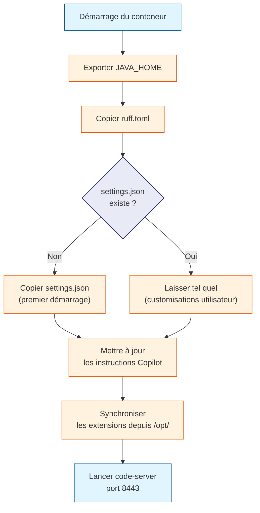

# ide/entrypoint.sh — ligne par ligne

`entrypoint.sh` est le script lancé **automatiquement** à chaque démarrage
du conteneur `zdev-ide`. C'est lui qui prépare l'environnement avant de
lancer VS Code.

**Fichier :** `ide/entrypoint.sh`
**Déclenché par :** la directive `ENTRYPOINT ["/entrypoint.sh"]` du Dockerfile
**Durée :** ~1 à 15 secondes selon si les extensions sont déjà dans le volume

---

## Vue d'ensemble du script



---

## En-tête du script

```bash
#!/bin/bash
set -euo pipefail
```

`#!/bin/bash` — Le "shebang" indique au système quel interpréteur utiliser
pour exécuter ce script. Ici : Bash (et non Zsh ou sh).

`set -euo pipefail` — Rend le script plus robuste :
- `-e` : arrête le script dès qu'une commande échoue (exit code ≠ 0)
- `-u` : arrête le script si une variable non définie est utilisée
- `-o pipefail` : fait échouer un pipe entier si l'une des commandes du pipe échoue

Sans ces options, un script bash continue silencieusement malgré les erreurs,
ce qui peut mener à des états incohérents difficiles à déboguer.

---

## Export de JAVA_HOME

```bash
export JAVA_HOME=/opt/java
export PATH="$JAVA_HOME/bin:$PATH"
```

`JAVA_HOME` indique aux applications Java (et aux extensions VS Code qui
les appellent) où trouver l'installation Java.

`PATH` — Ajoute `/opt/java/bin` en tête du PATH pour que la commande `java`
soit trouvée en priorité (même si une autre version était présente dans le
système).

!!! note "Pourquoi ne pas le mettre directement dans le Dockerfile ?"
    Ces variables sont déjà définies dans le Dockerfile, mais les volumes
    Docker peuvent modifier l'environnement. Le re-export dans entrypoint.sh
    garantit qu'elles sont bien présentes dans le processus code-server.

---

## Copie de ruff.toml

```bash
cp /tmp/ruff.toml /home/zdev/ruff.toml
```

`ruff.toml` est la configuration du linter Python. Il est copié à **chaque
démarrage** (contrairement à `settings.json`) car c'est une configuration
du projet, pas une préférence personnelle de l'utilisateur.

- Source : `/tmp/ruff.toml` (copié depuis le host par le Dockerfile)
- Destination : `/home/zdev/ruff.toml` (accessible depuis le workspace)

---

## Copie conditionnelle de settings.json

```bash
if [ ! -f /home/zdev/.local/share/code-server/User/settings.json ]; then
    cp /tmp/settings.json /home/zdev/.local/share/code-server/User/settings.json
fi
```

Cette condition est le cœur du mécanisme de personnalisation :

- **Premier démarrage** — Le fichier n'existe pas → on copie les paramètres
  par défaut du projet (thème Catppuccin, police Fira Code, linter Ruff, etc.)

- **Démarrages suivants** — Le fichier existe (dans le volume `~/zdev/editor/settings/`)
  → on ne touche à rien. L'utilisateur peut avoir changé son thème, ses
  raccourcis clavier… tout est préservé.

Le fichier `settings.json` est monté via le volume `~/zdev/editor/settings/`,
donc il **persiste entre les redémarrages et les recréations du conteneur**.

---

## Mise à jour des instructions Copilot

```bash
cp -r /tmp/copilot/ /home/zdev/.config/copilot/
```

Contrairement à `settings.json`, les instructions Copilot sont **toujours**
mises à jour. Ce sont des fichiers de configuration du projet (comment écrire
du COBOL, du Bash…), pas des préférences personnelles.

`-r` — Copie le dossier de manière récursive (avec tous ses sous-dossiers
et fichiers).

---

## Synchronisation des extensions VS Code

C'est la partie la plus complexe du script. Elle résout le problème des
volumes Docker qui masquent les fichiers de l'image.

### Contexte du problème

```
Image Docker contient :
  /opt/code-server/extensions/   ← Extensions installées au build

Volume Docker monte :
  ~/zdev/editor/extensions/
    → /home/zdev/.local/share/code-server/extensions/
```

Quand Docker monte le volume, il remplace le dossier `extensions/` de
l'utilisateur `zdev` par le contenu du volume (vide au premier démarrage).
Les extensions installées dans `/home/zdev/` seraient donc invisibles.

La solution : installer les extensions dans `/opt/` (jamais monté comme volume)
et les copier vers le volume au démarrage.

### Le code de synchronisation

```bash
STAGED="/opt/code-server/extensions"
USEREXT="/home/zdev/.local/share/code-server/extensions"
if [ -d "$STAGED" ]; then
    mkdir -p "$USEREXT"

    for ext_dir in "$STAGED"/*/; do
        [ -d "$ext_dir" ] || continue
        ext_name=$(basename "$ext_dir")
        if [ ! -d "$USEREXT/$ext_name" ]; then
            cp -r "$ext_dir" "$USEREXT/"
        fi
    done
```

**Étape 1 : copier les dossiers manquants.**
Pour chaque extension dans `/opt/code-server/extensions/`, on vérifie si
elle existe déjà dans le volume. Si non, on la copie. Cela préserve les
extensions que l'utilisateur a installées lui-même.

### Reconstruction de extensions.json

```python
import json, os

staged_json = "/opt/code-server/extensions/extensions.json"
user_dir    = "/home/zdev/.local/share/code-server/extensions"
dest_json   = f"{user_dir}/extensions.json"

with open(staged_json) as f:
    staged = json.load(f)

for e in staged:
    if "location" in e and "path" in e["location"]:
        e["location"]["path"] = e["location"]["path"].replace(
            "/opt/code-server/extensions", user_dir
        )
```

`extensions.json` est le registre interne de code-server. Il liste toutes
les extensions reconnues avec leur chemin absolu.

Lors du build, les chemins pointaient vers `/opt/code-server/extensions/…`.
Il faut les remplacer par les chemins dans le volume :
`/home/zdev/.local/share/code-server/extensions/…`.

Sans cette correction, code-server ne reconnaîtrait pas les extensions copiées
dans le volume et les marquerait comme orphelines.

```python
staged_ids = {e["identifier"]["id"] for e in staged}
extras = [e for e in existing if e["identifier"]["id"] not in staged_ids]

with open(dest_json, "w") as f:
    json.dump(staged + extras, f)
```

On fusionne les extensions de l'image (staging) avec les extensions
installées par l'utilisateur (`extras`). Cela garantit que les deux sont
visibles dans VS Code.

### Vidage de .obsolete

```bash
echo '{}' > "$USEREXT/.obsolete"
```

code-server tient une liste `.obsolete` des extensions qu'il juge orphelines
(non déclarées dans `extensions.json`) et les supprime au démarrage suivant.

En réinitialisant ce fichier à `{}` (JSON vide), on empêche code-server de
supprimer des extensions qu'il ne reconnaît pas encore (par exemple, des
extensions qu'on vient juste de copier depuis le staging).

---

## Lancement de code-server

```bash
exec code-server --bind-addr 0.0.0.0:8443 .
```

`exec` — Remplace le processus shell actuel par le processus code-server.
Sans `exec`, le shell resterait en vie en tant que processus parent, et les
signaux Docker (SIGTERM pour l'arrêt propre) n'atteindraient pas code-server.

`--bind-addr 0.0.0.0:8443` — Écoute sur toutes les interfaces réseau du
conteneur (pas seulement `localhost`). Cela permet à Docker de router le
port 8443 depuis la machine hôte.

`.` — Ouvre le dossier courant (`/home/zdev/workspace`) comme workspace
VS Code par défaut.
