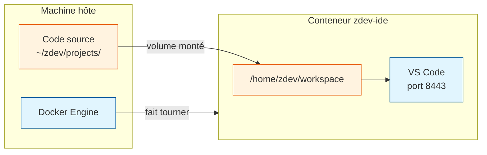

# Lecture des sources

Cette section analyse chaque fichier source du projet **ligne par ligne**.
Elle est destinée aux personnes qui veulent comprendre *comment* le projet
fonctionne en interne, pas seulement *comment l'utiliser*.

---

## À qui s'adresse cette section ?

- Vous voulez comprendre ce qui se passe quand vous lancez `make build`.
- Vous voulez modifier un comportement (ajouter une extension, changer un port…).
- Vous débutez avec Docker et voulez lire un vrai Dockerfile commenté.
- Vous êtes curieux des mécanismes bash, Python ou YAML utilisés ici.

---

## Fichiers couverts

| Fichier | Section |
|---------|---------|
| `Makefile` | [Makefile →](makefile.md) |
| `docker-compose.yml` | [Docker Compose →](docker-compose.md) |
| `ide/Dockerfile` | [Dockerfile →](dockerfile.md) |
| `ide/entrypoint.sh` | [Entrypoint →](entrypoint.md) |
| `ide/fetch_extensions.sh` | [Téléchargement des extensions →](fetch-extensions.md) |
| `ide/setup_host.sh` | [Initialisation de l'hôte →](setup-host.md) |
| `api/src/zapi/main.py` | [Code de l'API →](api-code.md) |

---

## Notion de base : Docker

Si vous débutez avec Docker, voici les trois concepts essentiels pour lire
les sources de ce projet :

**Image** — Un modèle figé. Comme un moule. `make build` crée les images.

**Conteneur** — Une instance en cours d'exécution d'une image. `make up`
démarre les conteneurs. Ils peuvent être supprimés sans perdre vos données
si des volumes sont configurés correctement.

**Volume** — Un dossier partagé entre votre machine et le conteneur.
Tout ce qui est dans `~/zdev/` sur votre machine est visible dans le conteneur
et vice-versa. C'est ce qui rend vos projets et paramètres persistants.

